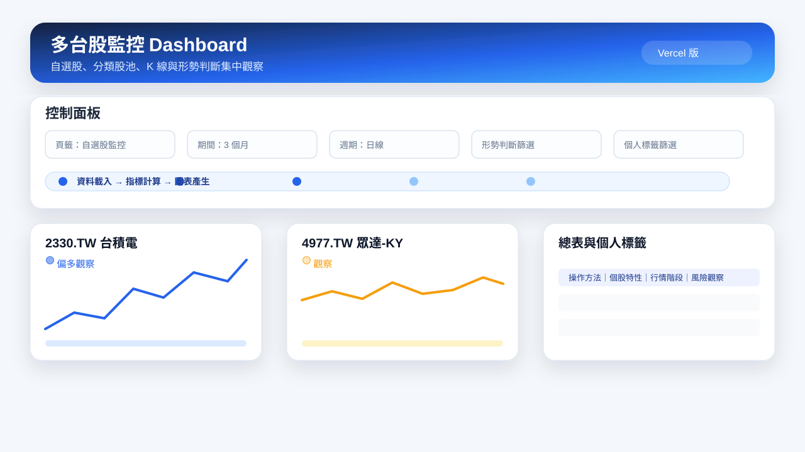
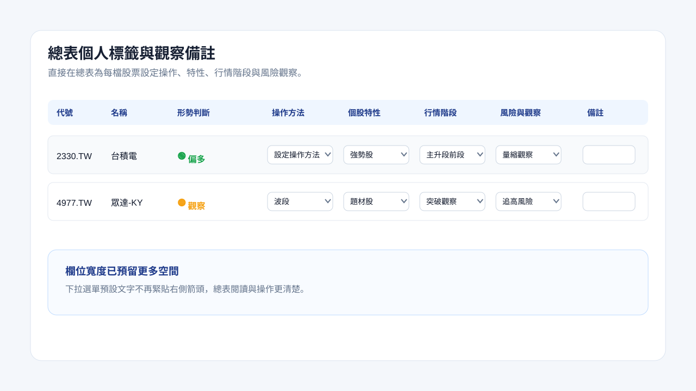
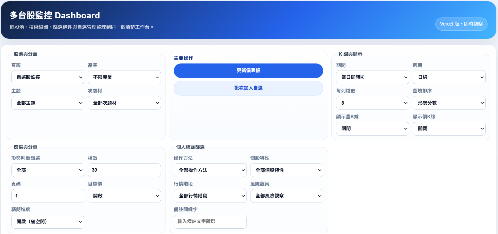
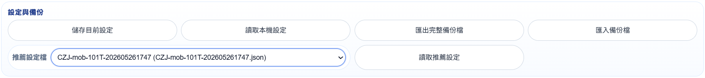
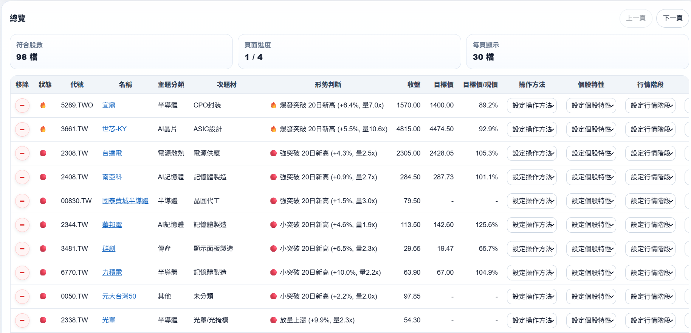
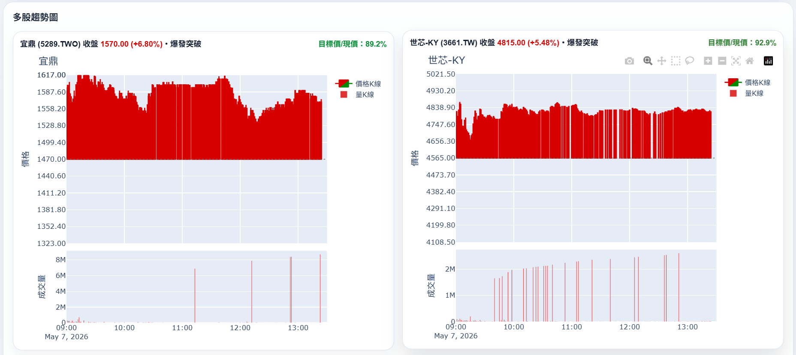
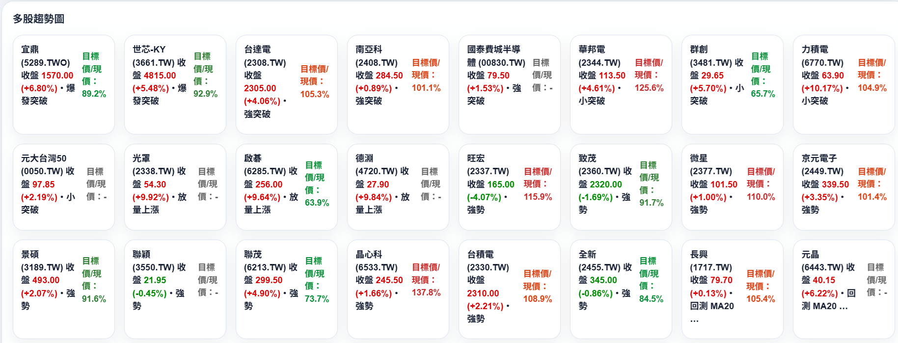

# 多台股監控 Dashboard（Vercel 版）

這個專案已全面改為 **Vercel 部署版本**，統一使用 `api/main.py` 的 WSGI Dashboard。

線上展示網址：[https://tw-stock-dashboard-six.vercel.app/](https://tw-stock-dashboard-six.vercel.app/)

> 已移除 Streamlit 版本，避免雙軌維護造成重構與維運混亂。

## 功能

- 一頁顯示多檔台股趨勢
- 支援 `watchlist.csv`
- K 線 + MA20
- RSI 14
- 形勢判斷與篩選（資料不足 / 偏多 / 觀察 / 風險 / 轉弱 / 中性）
- 可切換期間、K 線週期、股池來源（自選 / 分類）
- 支援設定儲存到瀏覽器、匯入 / 匯出 JSON 設定


## 示意圖

### Dashboard 總覽



### 總表個人標籤



## 功能截圖

### 篩選與排序選項



### 設定匯入 / 匯出



### 股票總表與個人標籤



### Dashboard 曲線圖



### Dashboard 文字摘要



## 本機開發

```bash
cd tw_stock_dashboard
python -m venv .venv
source .venv/bin/activate  # Windows: .venv\Scripts\activate
pip install -r requirements.txt
```

### 啟動 Dashboard 服務

本機看 Dashboard 需要啟動一個 WSGI 開發服務；Vercel 部署時才會直接匯入 `api/main.py` 的 `app` 物件。

```bash
python api/main.py
```

看到 `Serving ... http://127.0.0.1:8000` 後，用瀏覽器開啟該網址即可。可用環境變數調整監聽位置：

```bash
HOST=0.0.0.0 PORT=8000 python api/main.py
```

Windows PowerShell：

```powershell
$env:HOST="0.0.0.0"; $env:PORT="8000"; python api/main.py
```

### 產生每日題材快報

每日題材快報是離線批次腳本，不需要先啟動 Dashboard 服務；但它需要 `prebuilt_cache/` 內有對應價格快取，或執行時允許即時下載價格。若報告顯示全部股票都「缺價格資料」，請先更新快取或加上 live fetch。完整設計、日期參數、GitHub Actions / Vercel 只讀下載流程請參考 [`docs/daily_theme_report.md`](docs/daily_theme_report.md)。

```bash
python scripts/prebuild_price_cache.py
python scripts/generate_theme_daily_report.py --output reports/daily_theme_report.md --as-of 2026-05-12
```

若只是本機臨時產生、且網路可連 Yahoo Finance / 交易所資料源，可直接允許即時抓價：

```bash
python scripts/generate_theme_daily_report.py --allow-live-fetch --output reports/daily_theme_report.md
```

> `--as-of` 只會指定報告標題日期；價格資料是否真的截止於該交易日，取決於 `prebuilt_cache/` 的更新時間。

## Vercel 部署

```bash
vercel
vercel --prod
```

Vercel 會直接執行 `api/main.py`。

## URL 參數

可透過 QueryString 調整頁面狀態：

- `tab`: `watchlist` / `category`
- `industry`: 產業代碼（例如 `24`）
- `period`: `3mo` / `6mo` / `1y`
- `interval`: `1d` / `1wk`
- `limit`: 顯示檔數
- `status_filter`: `all` / `watch` / `bull` / `observe` / `warn` / `bear` / `neutral`
- `card_sort`: `signal_score`（預設）/ `symbol` / `close` / `volume` / `change_pct` / `target_ratio`
- `show_target_price`: `0` / `1`（預設 `0`；開啟會逐檔查 Yahoo 目標價，速度較慢）
- `compact_progress`: `1` / `0`（預設 `1`；開啟後將處理進度縮成單列精簡顯示）

## 自選股清單

編輯 `watchlist.csv`：

```csv
symbol,name,group
2330.TW,台積電,權值參考
4977.TW,眾達-KY,AI光通訊
4971.TWO,IET-KY,AI光通訊
```

上市股票通常用 `.TW`，上櫃股票通常用 `.TWO`。

## Codex 多階段精進指引

後續若要把 Gemini agent 題材 / 次題材 Excel、個股摘要與來源連結，逐步擴充成題材輪動雷達、題材型選股器、個股研究卡與每日快報，可參考：[`docs/codex_llm_theme_enhancement_guide.md`](docs/codex_llm_theme_enhancement_guide.md)。

## 主題分類匯入（可選）

程式會依序載入多層分類資料，讓人工維護的 `watchlist.csv` 仍可覆寫自動化結果。

### Gemini agent 分析結果

若有 Gemini agent 爬資料後產生的結果，可將檔案放在
`data/tw_stock_llm_datasource_excel/tw_stock_analysis_result_Gemini_agent.xlsx`。程式會讀取第一個工作表，支援欄位：

- `symbol`
- `name`
- `group` 或 `theme` / `題材`
- `subgroup` 或 `subtheme` / `次題材`（可選）

### 舊版 LLM 分類結果

舊版批次分析輸出可放在 `data/tw_stock_llm_source_with_group.xlsx`，
並使用工作表 `LLM_result_stock_group_json_fla`。程式會讀取欄位：

- `symbol`
- `name`
- `group`
- `subgroup`（可選）

合併優先序由低到高為：

1. 交易所 / 櫃買官方產業別 fallback
2. 舊版 LLM 分類 `data/tw_stock_llm_source_with_group.xlsx`
3. Gemini agent 分析結果 `data/tw_stock_llm_datasource_excel/tw_stock_analysis_result_Gemini_agent.xlsx`
4. `watchlist.csv` 手動自選股分類

若同一 `symbol` 重複，較高優先序的資料會覆寫較低優先序分類。

### 為什麼題材資料有些股票不在官方產業表？

「分類股池 / 不限產業」會合併官方產業表與 Excel 題材資料；Excel 是離線產生的題材清單，可能包含當時仍在清單內、但現在不在本次交易所 / 櫃買 OpenAPI 產業表內的標的。常見原因包括：

- 題材 Excel 產生時間與官方 OpenAPI 查詢時間不同，代號可能已更名、換代號、下市櫃或停止公開交易。
- Excel 來源可能含上市、上櫃以外的興櫃、ETF / ETN、特殊證券或人工加入的觀察標的；官方產業表只用來取得上市 / 上櫃公司產業別 fallback。
- 部署環境若暫時連不到交易所 / 櫃買 OpenAPI，官方產業表會少載或載不到，但 Excel 題材資料仍會載入。
- 不在官方產業表不等於公司已停止營運；是否仍可交易 / 營運，應再用 K 線下載結果、公開資訊觀測站、交易所 / 櫃買公告或公司 IR 資料確認。


## 效能瓶頸與加速策略

切換頁籤或刷新頁面時，後端會重新組合股池、抓取每頁股票價格、計算技術指標並產生 Plotly 圖表。最容易造成等待的環節有三個：

1. **價格資料**：日線 / 週線會優先讀取 `prebuilt_cache/`，避免每次頁面操作都打 Yahoo Finance。預建快取現在允許保留 7 天；分鐘線仍維持短 TTL，以免盤中資料過舊。
2. **靜態股池資料**：自選清單、LLM 分類 Excel、上市 / 上櫃產業清單會在同一個 Python process 內快取，減少重複讀檔與重複呼叫交易所 OpenAPI。
3. **目標價**：Yahoo `Ticker.get_info()` 是逐檔外部查詢，容易拖慢整頁渲染；因此預設關閉，需要時可從頁面上的「目標價」選單或 `show_target_price=1` 開啟。

若要維持最快刷新速度，建議：

- 使用日線 / 週線並定期執行 `python scripts/prebuild_price_cache.py` 更新 `prebuilt_cache/`。
- 每頁檔數不要一次拉太大；頁面仍需為每檔股票產生 Plotly HTML。
- 非必要時保持「目標價」關閉。

## 免責聲明

這不是投資建議，僅用於觀察與資料整理。

## 預先產生快取（適合 Vercel 唯讀檔案系統）

Vercel 執行環境是唯讀，不適合在使用者操作時動態落盤快取。
本專案改為支援「**先在本機或 CI 預產生快取檔，再跟程式一起 deploy**」。

### 1) 產生快取檔

```bash
python scripts/prebuild_price_cache.py
```

會將自選股的歷史資料輸出到 `prebuilt_cache/`。

### 2) 提交到 GitHub

```bash
git add prebuilt_cache scripts/prebuild_price_cache.py
git commit -m "chore: refresh prebuilt price cache"
git push
```

### 3) Vercel 自動部署

push 後由 Vercel 自動部署，`api/main.py` 會優先讀取 `prebuilt_cache/` 的資料，降低使用者操作時等待。

## GitHub Actions 自動重建快取

已提供排程檔：`.github/workflows/rebuild-prebuilt-cache.yml`。

- 觸發方式：
  - 每週一到五 UTC `06:10`（約台北時間 `14:10`，收盤後）
  - 或手動 `workflow_dispatch`
- 流程：安裝依賴 → 執行 `python scripts/prebuild_price_cache.py` → 產生 `reports/daily_theme_report.md` → 若 `prebuilt_cache/` 或報告有變更就自動 commit + push。

> 第一次使用前，請確認 repository 的 Actions 權限允許 `contents: write`。
